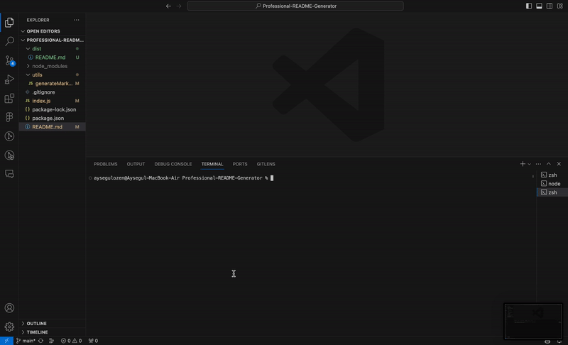

# Professional README Generator

## Description

The Professional README Generator is a command-line application that dynamically generates a professional README.md file based on user input. This application uses the Inquirer package to prompt the user with a series of questions about their project. The user's responses are then used to generate a README file with sections such as Description, Installation, Usage, Contributing, Tests, License, and Questions.

## Table of Contents

- [Installation](#installation)
- [Usage](#usage)
- [License](#license)
- [Contributing](#contributing)
- [Tests](#tests)
- [Questions](#questions)

## Walkthrough Video

Click on the image above to watch a walkthrough video demonstrating the functionality of the README generator. The video covers how to invoke the application, enter responses to prompts, and view the generated README with a functioning table of contents.

## Installation

To install the application, follow these steps:

1. Clone the repository to your local machine.
2. Navigate to the project folder in the terminal.
3. Run the command `npm install` to install the required dependencies.

## Usage

To use the application, follow these steps:

1. Navigate to the project folder in the terminal.
2. Run the command `node index.js` to start the application.
3. Answer the prompted questions about your project.
4. Once all questions are answered, the application will generate a README.md file in the root directory.

## License

This project is licensed under the MIT License - see the [MIT](MIT) file for details.

## Contributing

Contributions are welcome! If you would like to contribute to the project, please follow these steps:

1. Fork the repository.
2. Create a new branch for your feature or bug fix.
3. Make your changes and commit them to your branch.
4. Submit a pull request.

## Tests

To run tests, follow these steps:

1. Navigate to the project folder in the terminal.
2. Run the command `npm test` to execute the tests.

## Questions

For any questions or feedback, feel free to contact me:

- GitHub: [aysegul Ozen](https://github.com/Aysegulozen/)
- Email: aysegul.bu@hotmail.com
